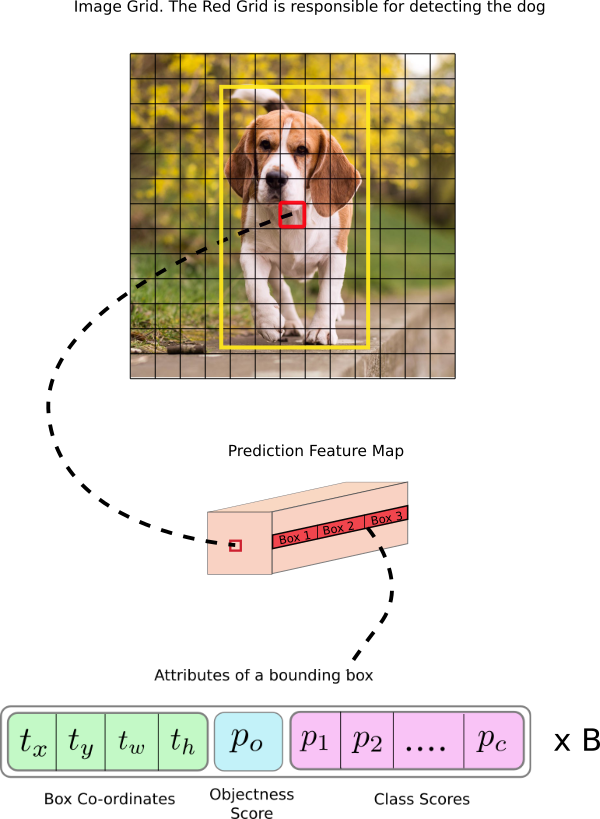

# Object-Detection

This repo is about one of the algorithm studied as part of Deep learning project CS7643.

YOLO object detection in pytorch.

[TODO]Things need to be done:
* Make it minimalistic
* add real time object detection 
* add mobile support

References: Pytorch-Yolov3

Object detection is a subset in computer vision which deals with automatic methods for identifying objects of interests in an image with respect to the background. In this repo we will implement and understand how YOLOv3 works.

Object detection plays a important role in Computer Vision and Deep Learning. There are two standard approaches for object detection which leads to different sets of algorithms.

* The first category is to deal with region proposal first. This means region which are highly like to contain objects are selected with either traditional CV techniques like selective search or using deep learning techniques such as region proposal network. This category includes algorithms like R-CNN, Fast R-CNN.

* The second category of algorithms looks for object at fixed location with fixed sizes. These location and sizes are strategically selected to cover the object entirely. The original image in these algorithms are separated using fixed size grid regions. For each region these algorithm tries to predict a fixed number of objects of certain, predetermined shape. These are single stage algorithms and YOLO, SSD belongs to this category.

# YOLOv3
Unlike many other object detection system, such as R-CNN, YOLO frames object detection as a regression problem to spatially separated bounding boxes and associated class probabilities.YOLO uses a single neural network which predicts bounding boxes and class probabilities directly from full images in one evaluation. The advantage of using YOLO is that it  reasons globally about the image when making predictions. Unlike sliding window and RCNN techniques, YOLO sees the entire image during training and test time so it implicitly encodes the contextual information about classes as well as their appearance in the image.This also makes YOLO the best choice for real time object detection method.

In a very high level this is how YOLO works:

Consider the below figure

1. Divide the image into multiple grids.
2. Each cell gives 3 boxes in feature maps like shown in the figure: b1,b2,b3. These boxes are chosen using k means algorithm   considering the scale, size, aspect ratio into consideration.
3. Each box is responsible for spitting out 3 things: 
  1. Box cordinates: tx,ty,tw,th (tx,tx = x,y cordinate of the top leftmost cell, tw,th = width and height of the box) which
     is the probable box containing the object.
  2. Objectness score represents the probability that an object is contained inside a bounding box. It should be nearly 1 for      the red and the neighboring grids, whereas almost 0 for, say, the grid at the corners.
  3. Class confidences represent the probabilities of the detected object belonging to a particular class (Dog, cat, banana,        car etc). Before v3, YOLO used to softmax the class scores.

 

  For more clarity we can see in the above figure that we can see that if the center of the object's ground truth bounding box falls in a certain grid cell(i.e. the red one on the bird image),  this grid cell is responsible for predicting the object's bounding box. The corresponding objectness score is "1" for this grid cell and "0" for others. For each grid cell, it is assigned with 3 prior boxes of different sizes(these boxes are created using K means algorithm). What it learns during training is to choose the right box and calculate precise offset/coordinate. But how does the grid cell know which box to choose? There is a rule that it only chooses the box that overlaps ground truth bounding box most using the Intersection over union value.
  
YOLOv3 uses 75 convolution layer, with skip connections, and upsampling layers. There is no pooling done in YOLO, and stride of 2 is used to downsample the features maps. This downsampling helps in reducing the loss which is attributed to pooling.Being a fully convolution network the YOLO is invariant to the size of the input. The loss function in YOLO has multiple parts:

* A bounding box coordinate error measured using mean square error.
* Object error which is a confidence score of whether there is an object or not. When there is an object, we want the score equals to IOU, and when there is no object we want to score to be zero. This is also mean square error.
* Classification of object which uses cross entropy loss.

## Dataset
For training I used Microsoft COCO datase\cite{coco}. But since YOLO is incompatible with the coco dataset as it uses the darknet for the backbone network, we used only 2014 coco dataset. The training data was Augumented with horizontal flip only, and no data augmentation is done on the test set. The result can be seen in qualitative results section.

## Training
We utilized the Pretrained network on COCO dataset using Darknet. Due to time and compute constraints We did not trained on the full 113000 images of the dataset, rather we used a subset of 35,000 images, with 80 classes of object detection. In the Figure below, we can see how the loss curve started to fall down with the step size. We trained the model for 50 epochs, with batch size of 8, with momentum=0.9, decay=0.0005, iou-threshold=0.5.

## Validation
We used the COCO validation set of 5000 images for validation. The mean average precision we got is 0.58, with detecting all the classes. We can see the results for some of the classes in Table 2.

AP (Average Precision) for different classes of the pretrained Yolo model on COCO 2014 dataset

| Class  	|  AP 	| Class | AP
|---	|---	|--- |--- |
|aeroplane	| 0.7540  	| pottedplant   	|0.5069   	|
|diningtable   	|0.2885   	|car   	|0.8584   	|
|dog   	|  0.6976  	|sheep   	|0.7767   	|
|bird   	| 0.1813  	|cat   	|0.8568   	|
|horse   	|0.8702   	|sofa   	|0.7894   	|
|boat   	|0.5299   	|chair   	|0.7546   	|
|motorbike   	|0.7213   	|train   	|0.8623   	|
|bottle   	|0.465   	|cow   	|0.7546   	|
|person   	| 0.7176  	|tvmonitor   	|0.7670   	|
|bus   	|0.9681   	|||

# Qualitative Result

